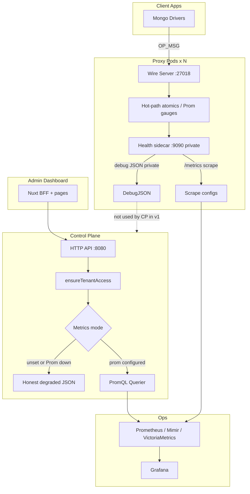
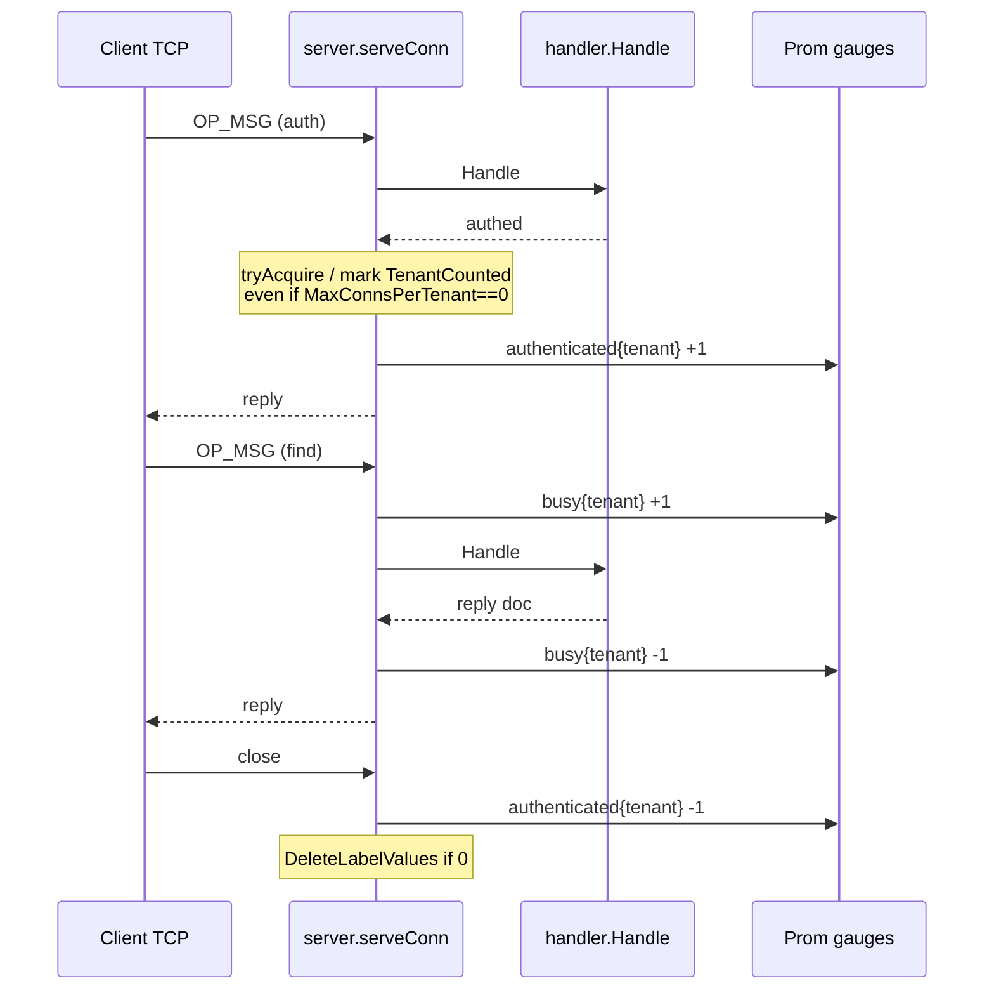
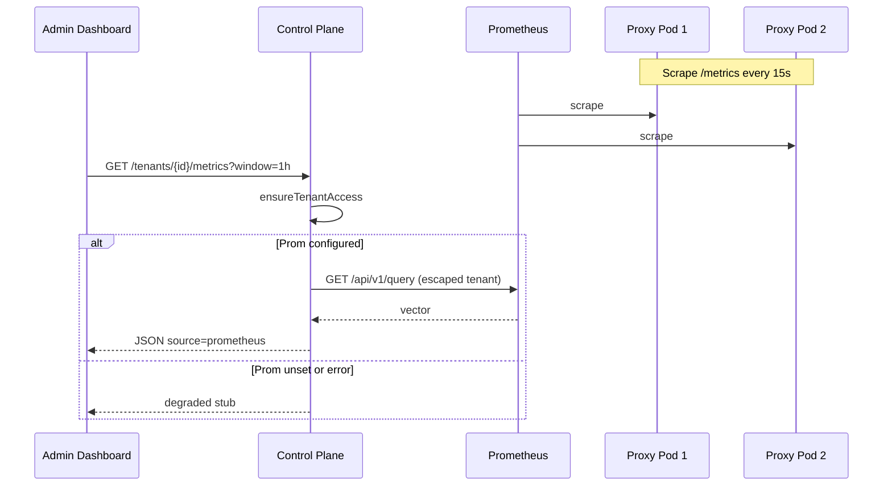

# Org-level Connection & Cache Metrics at Scale

| Field | Value |
|-------|-------|
| **Status** | Implemented (rev 2) — code + nance-deploy Prometheus |
| **Author** | TBD |
| **Date** | 2026-07-11 |
| **Scope** | Nance Accelerator data plane + control plane + admin dashboard |
| **Related packages** | `apps/accelerator/internal/{telemetry,proxy,controlplane}`, `apps/admin-dashboard` |

---

## Overview

Nance Accelerator is a multi-tenant MongoDB cache proxy. Operators and customers need **org-scoped** visibility into:

1. **Client connections** — how many authenticated app→proxy TCP sessions are open (product primary); optionally how many are in-flight “busy” right now (ops secondary)
2. **Backend pool state** — proxy→MongoDB client pool usage per org (and optionally per source Connection)
3. **Cache effectiveness** — hit rate, miss rate, bypass, bytes saved, latency

Today most of this data is either **global** (`nance_proxy_connections_active`), **process-local and unexported** (`server.tenantN`), **high-cardinality Prometheus counters** (`ns` labels), or **stub product APIs** (`GET /tenants/{id}/savings` returns PromQL suggestions only). The `savings` package exists but is **not wired** into the proxy hot path. Control plane and proxy are **separate processes** — the control plane cannot read proxy memory without Prometheus or explicit pod HTTP fan-in.

This design proposes a **two-surface metrics architecture**:

- **Ops surface**: Prometheus scrape of proxy health sidecars (`:9090/metrics`) with carefully budgeted label cardinality, plus Grafana dashboards for cluster-wide views.
- **Product surface**: org-authorized control-plane APIs that return **multi-pod** metrics for the admin dashboard. **v1 uses Prometheus PromQL only** (scrape lag 15–30s for gauges). Three explicit modes: PromQL primary, optional fan-in (post-v1), honest degraded stub.

Hot-path recording stays lock-free / atomic (matching `cachestats.Tracker`). Multi-pod aggregation is **pull-based via Prometheus scrape**, not app-level remote_write or Pushgateway.

---

## Background & Motivation

### Domain model (existing)

- **Org ≈ tenant**: `model.Tenant` is “a customer / project that uses the accelerator (an organization in the UI)”.
- **Source backends** are `model.Connection` rows under a tenant (`tenantId`).
- **Proxy tokens** bind a client to `tenantId` + `connectionId` (`auth.TenantContext`).
- Clients authenticate with PLAIN: username=`tenantId`, password=raw token.

### Current metrics inventory

**Prometheus (`apps/accelerator/internal/telemetry/telemetry.go`)**

| Metric | Type | Labels | Gap / cardinality note |
|--------|------|--------|------------------------|
| `nance_proxy_connections_active` | Gauge | none | **Global only** — not per tenant |
| `nance_proxy_commands_total` | Counter | `tenant`, `command` | **`command` is unbounded today** (raw wire name, no allowlist) |
| `nance_proxy_command_duration_seconds` | Histogram | `command` | Same unbounded `command` risk; no tenant (good) |
| `nance_proxy_auth_success_total` | Counter | `tenant` | OK |
| `nance_proxy_auth_failures_total` | Counter | none | OK |
| `nance_proxy_backend_errors_total` | Counter | `tenant` | OK |
| `nance_proxy_rate_limited_total` | Counter | `tenant` | OK |
| `nance_cache_hits_total` / `_misses_total` | Counter | `tenant`, `ns`, `command` | **`ns` + unbounded `command` risk** |
| `nance_cache_bypass_total` | Counter | `tenant`, `reason` | Reasons are fixed strings today (see enum below) |
| `nance_cache_invalidations_total` | Counter | `tenant`, `ns`, `reason` | **`ns` cardinality risk** |
| `nance_cache_result_bytes` | Histogram | `tenant` | **~10 series/tenant** (buckets+_sum+_count) — not free |
| `nance_cache_latency_seconds` | Histogram | `path` (hit\|miss) | Global path only — OK |
| `nance_proxy_cached_cursors_active` | Gauge | none | Global only |
| Control-plane counters | various | `tenant` | Low volume |

**Bypass reason strings today** (`cache.ShouldBypassCache` + handler):

| Reason | Source |
|--------|--------|
| `transaction` | txn / `txnNumber` |
| `explain` | explain command |
| `agg_stage` | `$out` / `$merge` / `$changeStream` |
| `command` | non-cacheable command name |
| `bad_key` | handler key build failure |
| `size` | result exceeds max bytes |

There is **no** `policy` or `unauth` bypass label today (cache opt-in is `_cache` suffix / policy path, not a bypass reason). Intentional additions (e.g. `redis_unavailable` as bypass vs separate counter) must be deliberate constants.

**Process-local trackers**

| Component | Path | Behavior |
|-----------|------|----------|
| `cachestats.Tracker` | `proxy/cachestats/stats.go` | Atomics + `sync.Map` per `tenant\x00db\x00coll`; exposed on `/cache-stats?tenant=` |
| `savings.Tracker` | `proxy/savings/tracker.go` | Per-tenant hit/miss/bytes; **not wired** into `cmd/proxy` or `handler` |
| `server.tenantN` | `proxy/server/server.go` | `map[string]int` of open **authenticated** client conns per tenant when limit enabled; used for `MaxConnsPerTenant` (default 200). **When `MaxConnsPerTenant==0`, `tryAcquireTenantConn` returns true without incrementing `tenantN`** |
| `connExtraMap` | `proxy/server/server.go` | Global map for `tenantCounted`; **never deleted on disconnect (leak)** |
| Backend pool | `proxy/pool/pool.go` | One `mongo.Client` per **connectionID** (comments/tests sometimes say “tenant” incorrectly); `refs` + `lastUsed` + idle eviction (default 15m); only `ClientCount()` exported |

**Health sidecar** (`proxy/health/health.go`, default `:9090`)

- `/healthz`, `/readyz`, `/metrics` (promhttp), `/cache-stats`
- **No authentication** on any path — must stay on private network / NetworkPolicy only

**Product API**

- `GET /api/v1/tenants/{tenantId}/savings` — stub; notes that live counters are on proxy `/metrics` (legacy metric names in suggestions).
- Admin dashboard has `getSavings()` composable + BFF proxy route, but **no UI consumption** of real numbers yet.
- Tenant page UI is **connection-centric** (selected Connection for policies/tokens/invalidate).

**Process topology**

- `cmd/proxy` and `cmd/controlplane` are **separate binaries**. No shared memory. There is no single-binary mode that makes CP “local savings” meaningful without HTTP to a proxy or Prometheus.

### Pain points

1. **Cannot answer “how many connections does org X have?”** across the cluster without labeled gauges + Prom sum.
2. **In-flight “active”** is a poor product primary: sequential per-conn handling means scrapes almost always see active≈0 (see Definitions).
3. **Hit % for product UI** requires multi-pod sum of counters + PromQL; control plane cannot serve it today.
4. **Cardinality** of `ns` and unbounded `command` can explode.
5. **`savings` package is dead code** relative to the running proxy; three parallel accounting paths risk divergence.
6. **Histogram-with-tenant** (`CacheResultBytes`) alone can blow the series budget at multi-k tenants.

---

## Goals & Non-Goals

### Goals

1. Define a precise **metric catalog** with connection semantics (product primary = authenticated open), backend pool state, and cache effectiveness, with **cardinality budgets including histograms**.
2. Keep the **Mongo wire hot path cheap**: atomics / Prom Inc-Dec only; no network I/O on record.
3. Support **multi-pod aggregation** for ops and product via **Prometheus scrape + PromQL** (v1).
4. Expose **org-scoped product APIs** with the same authz as savings (`ensureTenantAccess`), with a full query contract.
5. Evolve `/savings` into a richer **metrics snapshot + time series** API consumable by admin-dashboard.
6. Document **scale targets**, risks, rollout, and an incremental PR plan.

### Non-Goals

- Replacing Prometheus as the ops source of truth for cluster health.
- Per-request tracing / full APM (OpenTelemetry spans).
- Billing accuracy to the cent.
- Real-time push of every metric sample to the control plane.
- **v1 pod fan-in** from control plane to all proxy sidecars (deferred; see Multi-pod).
- **v1 per-connection Prometheus labels** for backend/client gauges (ops flag only, distinct metric name).
- Labeling every series by full Mongo namespace forever.
- Multi-region miss-forwarding metrics (region affinity stubbed).
- Cluster-global connection limits (current limit is **per pod**).

---

## Scale Targets (Assumptions)

These are **planning assumptions** for Nance Accelerator production; tune per deployment.

| Dimension | Target / assumption |
|-----------|---------------------|
| Tenants (orgs) | 1,000 – 10,000 |
| Source Connections per tenant | 1 – 20 (p50 ≈ 2) |
| Proxy replicas (pods) | 3 – 50 per region |
| Concurrent client TCP conns (cluster) | 10,000 – 100,000 |
| Peak commands/s (cluster) | 50k – 500k |
| Commands/day | 10⁸ – 10⁹ |
| Distinct `command` label values **after allowlist** | ≤ 40 (`other` for rest) |
| Distinct `ns` (db.coll) per tenant (worst) | 10² – 10⁴ |
| Prometheus scrape interval | **15s** (ops + product gauges) |
| Product UI refresh | 15–60s; accept **scrape lag** as “live” freshness |
| Memory budget per Prometheus series | ~3–4 KB active (rule of thumb) |
| **Series budget (proxy process)** | Prefer **&lt; 50k series/pod** steady-state; alert at 80k |

### Series budget sketch (recommended final state)

Assumptions for “hot” pod: **T = 5,000** tenants with ≥1 open auth conn or ≥1 counter series on this pod. Classic Prometheus histogram with default/custom buckets ≈ **B+2** time series per label set (B buckets + `_sum` + `_count`). `nance_cache_result_bytes` uses **7** buckets → **~9 series per tenant**.

| Family | Labels | Formula @ T=5k | Series |
|--------|--------|----------------|--------|
| Client authenticated open gauge | `tenant` | 1 × T | **5,000** |
| Client in-flight busy gauge (ops) | `tenant` | 1 × T (only when >0 if we Delete on zero) | **≤5,000** |
| Backend clients | `tenant`, `state∈{in_use,idle}` | 2 × T_backend ≤ 2 × T | **≤10,000** |
| `nance_cache_requests_total` | `tenant`, `result∈{hit,miss,bypass}` | 3 × T | **15,000** |
| `nance_cache_bytes_served_total` | `tenant`, `source∈{cache,backend}` | 2 × T | **10,000** |
| `nance_cache_bypass_total` | `tenant`, `reason` (6 reasons) | 6 × T_bypass | **≤30,000** worst; sparse in practice |
| Commands (reformed) | `tenant` only | 1 × T | **5,000** |
| Commands by type | `command` allowlist ≤40 | 40 | **40** |
| Auth / errors / rate-limit | `tenant` each | 3 × T | **15,000** |
| Cached cursors | `tenant` | 1 × T | **5,000** |
| `nance_cache_result_bytes` histogram | **none (global)** or drop | ~9 | **~9** |
| `nance_cache_latency_seconds` | `path` only | 2 × ~9 | **~18** |
| Command duration histogram | `command` allowlist | 40 × ~12 | **~480** |
| **Subtotal (safe final, sparse lower)** | | | **~50–70k theoretical max if all dense** |

**Hard decisions from the budget:**

1. **Drop `tenant` from `nance_cache_result_bytes`** (or replace with counter `nance_cache_bytes_served_total` only — no per-tenant histogram). Per-tenant histogram at 5k tenants ≈ **45k series alone** → over budget.
2. **Never add `tenant` to latency histograms** in v1.
3. **Split `tenant`×`command` command counters** immediately after allowlist.
4. **Dual-write period** temporarily **adds** legacy `hits/misses{tenant,ns,command}` — schedule short soak; do not leave dual-write on for months. Budget alert during dual-write must use higher threshold or exclude legacy.
5. **Bypass reason** stays; series are sparse (most tenants hit few reasons). Prefer not expanding reason enum carelessly.
6. Optional `nance_proxy_backend_clients_by_connection` is **off by default** and uses a **distinct metric name**.

**Mitigation summary (revised safe plan):**

- Gauges: `tenant` only for client authenticated open + backend rollup.
- Counters: `tenant` + small enums (`result`, `source`, `reason`); command mix without tenant.
- **No `ns` on Prometheus** for hit/miss/invalidation.
- **No per-tenant histograms** in the final state.
- Command labels: **allowlist → `other`** before any other command-metric work.

---

## Definitions: Active vs Idle

These definitions are **implementable** against current code paths.

### A. Client-side (app → proxy TCP)

A **client connection** is a TCP session accepted in `server.ListenAndServe` and tracked in `Server.conns` until close. Handling is **sequential per TCP conn** (`serveConn` → `handleMsg` → `handler.Handle` → write reply): at most one in-flight command per socket, only for the duration of that request.

| State | Definition | Product vs ops | Implementation hook |
|-------|------------|----------------|---------------------|
| **Open (total)** | TCP accepted, not yet closed | Ops capacity | Global `ProxyConnectionsActive` |
| **Authenticated open** | TCP fully authed for tenant; counted toward org | **Product primary** | Gauge `nance_proxy_client_connections_authenticated{tenant}` (or state label fixed to `authenticated` — see catalog). Independent of `tenantN` / MaxConns |
| **Unauthenticated open** | TCP open, not authed | Ops / abuse | Optional global `nance_proxy_connections_unauth` |
| **In-flight busy** | Authenticated TCP currently inside `Handle` | **Ops secondary** (“busy right now”) | Gauge `nance_proxy_client_connections_busy{tenant}`; expect **≈0 under light load** at 15s scrape |
| **Idle (derived)** | `authenticated_open − busy` | Ops only; **do not** lead product cards with this pair | Derived in PromQL or API |

**Product primary metric (v1):** **authenticated open connections** cluster-wide:

```promql
sum(nance_proxy_client_connections_authenticated{tenant="T"})
```

**Why not in-flight as product primary:** under normal driver usage (many open sockets, short cache hits), scrapes almost always observe **busy ≈ 0–few** even at high QPS. Shipping `clientActive` as the hero card will look broken. Document busy as “commands being processed at scrape instant — often near zero.”

**Optional later (not v1):** “recently active” = last command within N seconds via `lastActivity atomic` timestamp on `ConnState`, exposed as gauge or computed on `/conn-stats` snapshot. Still cheap; defer until product asks for “working set” of conns.

**Notes**

- Unauthenticated conns must **not** inflate org metrics.
- **Gauges must not depend on `tenantN`**: when `MaxConnsPerTenant==0`, `tryAcquireTenantConn` does not increment `tenantN`. Always maintain a dedicated authenticated-conn counter / gauge path on auth success and disconnect.
- Per-tenant limit `NANCE_PROXY_MAX_CONNS_PER_TENANT` (default 200) is **per proxy process**, not cluster-wide.
- Idle TCP may still hold backend/emulated cursors; cursor metrics are separate.

### B. Backend-side (proxy → MongoDB)

The pool (`pool.Manager`) holds **one `mongo.Client` per source `connectionID`**, not per client TCP. (Code comments and `RefsForTest(tenantID)` naming are misleading — PR 2 renames test helpers/logs to `connection`.)

| State | Definition | Implementation hook |
|-------|------------|---------------------|
| **Backend client open** | Entry exists in `Manager.clients` for `connectionID` | Count map keys (`ClientCount()`) |
| **Backend in-use** | `tenantClient.refs > 0` | Snapshot under mutex; gauge state `in_use` if refs>0 else `idle` **per client** (0/1 contribution to tenant rollup gauges) |
| **Backend idle** | Entry exists, `refs == 0` | Eligible for eviction after `idleTimeout` |
| **Driver pool sockets** | Go driver internal pool | **Out of v1** (`event.PoolMonitor` later) |

**Org rollup**: sum open backend clients by state for all connectionIDs of a tenant. Store `tenantID` on `tenantClient` at connect (`conn.TenantID` already available in `connect()`).

### C. Per source Connection (product)

Admin UI is **connection-centric**. v1 product decisions:

| Metric class | v1 product | Notes |
|--------------|------------|-------|
| Client connections | **Tenant rollup only** | Clients auth as tenant; sockets are not strictly 1:1 with Connection but tokens bind to a Connection — still report **org-wide** with copy: “Across all connections” |
| Backend pool | **Tenant rollup** on Prom; connection detail only if ops flag enables distinct metric | Product cards: tenant-level |
| Cache hit/miss / savings | **Tenant rollup** | Same |
| Collection top-N | **Deferred v2** | Not connection-filtered in v1 |
| Connection-scoped insights | **v1 copy only** | Insights tab is tenant-level; do **not** silently change numbers when user switches selected Connection. Optional later: `?connectionId=` only if/when connection-labeled series or rollups exist |

---

## Proposed Design

### Architecture



### Design principles

1. **Record cheap, aggregate elsewhere** — hot path: `atomic` / Prometheus client `Inc`/`Dec` only.
2. **Prometheus is the multi-pod source of truth** for counters, rates, history, and (via scrape) gauges.
3. **Gauges are process-local** — cluster view = `sum by (tenant) (metric)`; product lag = scrape interval (~15s).
4. **Product never scrapes Prometheus with end-user credentials**; control plane does, with tenant filter + label escaping.
5. **Percentages are derived** in PromQL/API over a window — never hot-path hit-rate gauges.
6. **One outcome recorder** for cache economics: `recordCacheOutcome(...)` fans out to Prom + cachestats + optional savings; no divergent branches.
7. **Control plane cannot invent proxy-local data** without network — no fake “local savings” on CP.

### Control-plane data modes (explicit)

| Mode | When | Behavior |
|------|------|----------|
| **1. PromQL primary** | `NANCE_METRICS_PROM_URL` set and queries succeed | Snapshot + timeseries from Prometheus HTTP API; `source: "prometheus"`, `degraded: false` |
| **2. Pod fan-in** | **Not in v1** | Reserved: CP HTTP GET to proxy sidecars `/conn-stats`, `/savings-stats`, `/cache-stats`. Requires discovery + auth (see deferred section). Flag `NANCE_METRICS_POD_FANIN` stays **unimplemented / ignored** until designed. |
| **3. Degraded stub** | Prom URL empty **or** Prom errors after retries | Honest payload: `degraded: true`, numeric fields null/omitted, `note` explaining configure Prometheus or check scrape; keep `suggestedQueries` for operators. **Never** pretend CP has process-local savings. |

**Local dev:** docker-compose (or docs) should include optional Prometheus scraping `proxy:9090`, **or** operators accept degraded mode. Document binding health to non-public interfaces.

### Hot-path instrumentation changes

#### 1. Per-tenant client connection gauges (ownership)

```go
// telemetry.go (proposed) — distinct metrics, fixed label sets
// Product primary:
ProxyClientConnsAuthenticated = promauto.NewGaugeVec(prometheus.GaugeOpts{
    Name: "nance_proxy_client_connections_authenticated",
    Help: "Authenticated client TCP connections to this proxy process",
}, []string{"tenant"})

// Ops secondary (in-flight busy; often ~0 at scrape):
ProxyClientConnsBusy = promauto.NewGaugeVec(prometheus.GaugeOpts{
    Name: "nance_proxy_client_connections_busy",
    Help: "Authenticated client TCP connections currently handling a command (often near 0 at scrape)",
}, []string{"tenant"})
```

**ConnState ownership (mandatory in PR 1):**

```go
// handler.ConnState additions
TenantCounted bool          // replaces connExtraMap
InFlight      atomic.Int32  // 0 or 1 given sequential handling; still atomic for clarity
```

- **Delete** global `connExtraMap` entirely in PR 1 (fixes disconnect leak).
- **Server owns** authenticated gauge: +1 when connection becomes authenticated-and-counted, −1 on disconnect if counted. Do **not** use `tenantN` as the gauge source (limit may be 0/disabled).
- **Server wrapper around Handle** owns busy gauge: on enter authenticated Handle, `InFlight` 0→1 ⇒ busy +1; on exit 1→0 ⇒ busy −1. Keeps handler free of Prom gauge coupling if desired; either server `handleMsg` or a thin wrapper is fine — **one place only**.
- On `release` / disconnect: if still busy (should not), force busy −1; always Dec authenticated if counted.
- When authenticated gauge for tenant hits 0: `DeleteLabelValues(tenant)` (same for busy) to avoid label churn leaks.



Keep global `nance_proxy_connections_active` for all TCP (incl. unauth).

#### 2. Backend pool gauges

```go
ProxyBackendClients = promauto.NewGaugeVec(prometheus.GaugeOpts{
    Name: "nance_proxy_backend_clients",
    Help: "Open backend mongo.Client instances by tenant and ref state",
}, []string{"tenant", "state"}) // state = in_use | idle

// DISTINCT NAME — never same Name with different label set
ProxyBackendClientsByConnection = promauto.NewGaugeVec(prometheus.GaugeOpts{
    Name: "nance_proxy_backend_clients_by_connection",
    Help: "Open backend mongo.Client instances by tenant, connection, and state (ops flag)",
}, []string{"tenant", "connection", "state"})
```

`ProxyBackendClientsByConnection` registered only when `NANCE_PROXY_METRICS_CONNECTION_LABELS=1` (or always registered but never written when off — prefer **not registering** when off to avoid empty metric families).

Update on Get/Release/create/evict. Export:

```go
type PoolSnapshot struct {
    ConnectionID string    `json:"connectionId"`
    TenantID     string    `json:"tenantId"`
    Refs         int       `json:"refs"`
    Idle         bool      `json:"idle"`
    LastUsed     time.Time `json:"lastUsed"`
}
```

PR 2 also renames log fields / test helpers from “tenant” to “connection” where the id is `connectionID`.

#### 3. Cache metrics cardinality reform

| Destination | Labels | Purpose |
|-------------|--------|---------|
| Prom `nance_cache_requests_total` | `tenant`, `result∈{hit,miss,bypass}` | Product hit % SoT |
| Prom `nance_cache_bytes_served_total` | `tenant`, `source∈{cache,backend}` | Product bytes / savings |
| Prom `nance_cache_bypass_total` | `tenant`, `reason` (enum below) | Dimensional bypass |
| Prom latency / result size | **no tenant** | Ops size/latency distributions |
| `cachestats.Tracker` | tenant + db + coll | Debug `/cache-stats` |
| `savings.Tracker` | tenant (+ bytes) | Process-local `/savings-stats` only (debug; not CP SoT) |

**Bypass reason enum (code constants — single block for review):**

```go
const (
    BypassReasonTransaction = "transaction"
    BypassReasonExplain     = "explain"
    BypassReasonAggStage    = "agg_stage"
    BypassReasonCommand     = "command"
    BypassReasonBadKey      = "bad_key"
    BypassReasonSize        = "size"
    // Optional future: BypassReasonRedisUnavailable = "redis_unavailable"
    // Prefer keeping CacheUnavailable counter unless product needs it in bypass %.
)
```

**Migration:** dual-write legacy `nance_cache_hits_total{tenant,ns,command}` behind `NANCE_PROXY_METRICS_LEGACY_NS=1` (default on one release); then off; then delete vecs (PR 7 cleanup).

**Invalidations:** `nance_cache_invalidations_total{tenant,reason}` — drop `ns`.

#### 4. Command label allowlist (required before split)

Today `strings.ToLower(info.Name)` is used raw → unbounded cardinality.

```go
// metricsCommandLabel maps wire command names to a bounded set.
func metricsCommandLabel(name string) string {
    switch strings.ToLower(name) {
    case "find", "getmore", "aggregate", "count", "distinct",
        "insert", "update", "delete", "findandmodify",
        "hello", "ismaster", "saslstart", "saslcontinue",
        "ping", "endSessions", /* ...explicit list... */:
        return strings.ToLower(name)
    default:
        return "other"
    }
}
```

Apply to **all** command-labeled metrics (duration histogram, by-type counter, any dual-write legacy that still has command). Land allowlist in **PR 3a** (or PR 1 if touching command metrics early) **before** relying on “≤40 commands” budget.

**Command metric split (after allowlist):**

```text
nance_proxy_commands_total{tenant}           # product QPS per org
nance_proxy_commands_by_type_total{command}  # ops mix; command allowlisted
```

#### 5. `recordCacheOutcome` (single fan-out)

```go
type cacheResult string // "hit" | "miss" | "bypass"

// recordCacheOutcome is the ONLY place that increments product cache counters.
// Call exactly once per logical cache decision for a request.
func recordCacheOutcome(
    tenantID, db, coll string,
    result cacheResult,
    bypassReason string, // empty unless result==bypass
    payloadBytes int,    // result payload size when known; 0 if N/A
    stats *cachestats.Tracker,
    savings *savings.Tracker, // optional; nil OK
) {
    // 1) Prom SoT
    telemetry.CacheRequests.WithLabelValues(tenantID, string(result)).Inc()
    if result == "bypass" && bypassReason != "" {
        telemetry.CacheBypass.WithLabelValues(tenantID, bypassReason).Inc()
    }
    if payloadBytes > 0 {
        src := "backend"
        if result == "hit" {
            src = "cache"
        }
        if result == "hit" || result == "miss" {
            telemetry.CacheBytesServed.WithLabelValues(tenantID, src).Add(float64(payloadBytes))
        }
    }
    // 2) Process-local collection detail (hit/miss only)
    if stats != nil && (result == "hit" || result == "miss") {
        if result == "hit" {
            stats.RecordHit(tenantID, db, coll)
        } else {
            stats.RecordMiss(tenantID, db, coll)
        }
    }
    // 3) Process-local savings mirror (not CP SoT)
    if savings != nil && (result == "hit" || result == "miss") {
        if result == "hit" {
            savings.RecordHit(tenantID, payloadBytes)
        } else {
            savings.RecordMiss(tenantID, payloadBytes)
        }
    }
    // 4) Legacy dual-write (if flag): hits/misses with ns+command — still only from here
}
```

**Call sites (exactly once each path):**

| Path | When | result | Notes |
|------|------|--------|-------|
| Bypass early | `ShouldBypassCache` / bad_key / size before backend | `bypass` | Do **not** also count miss |
| Cache hit | after successful deserialize, `hit==true` | `hit` | bytes = served payload |
| Cache miss populate | **once** when populate finishes successfully | `miss` | Prefer counting in `recordCacheOutcome` **after** `GetOrLoad` returns miss, **not** inside populate **and** outside (today miss is inside populate — migrate carefully) |
| Redis fail-open | `ErrUnavailable` | **neither** hit nor miss as success path; keep `CacheUnavailable` counter; optional future bypass reason | Do not inflate hit ratio denominator incorrectly — exclude from hit/(hit+miss) |
| Size bypass inside populate | return errTooBig | `bypass` reason `size` only | Must not also count as miss |

**Invariant:** `hit + miss` counts for hit ratio; bypass and redis-unavailable are separate. Savings tracker is a **derived mirror**, not a second decision.

### Process-local JSON endpoints (sidecar)

Extend health sidecar for **ops/debug** (and future fan-in — not CP v1):

| Endpoint | Response |
|----------|----------|
| `GET /cache-stats?tenant=` | Existing |
| `GET /conn-stats?tenant=` | Authenticated open + busy + backend snapshot (process-local) |
| `GET /savings-stats?tenant=` | `savings.Tracker` snapshot after wired |

**Security:** private network only; never public LB. Optional later: shared scrape token header.

### Multi-pod aggregation strategies



| Approach | Pros | Cons | Decision |
|----------|------|------|----------|
| **A. Prometheus scrape only** | Standard, scales, retention | Product needs Prom; **15s gauge lag** | **v1 primary (only product data path)** |
| **B. CP fan-in to pods** | Sub-scrape live gauges | Discovery, auth, partial merge | **Deferred post-v1** |
| **C. Pushgateway** | | Anti-pattern for multi-instance gauges | **Reject** |
| **D. App remote_write** | No scrape config | Write amp; another client stack; duplicates agent pattern | **Reject custom remote_write in proxy v1** |
| **E. Grafana Agent / Mimir sidecar remote_write** | Ops-standard | Outside app code | **Optional ops later**; not app responsibility |
| **F. CP embedded TSDB** | Full product control | Dual stack | **Defer** |

**v1 product “live connections” lag = Prometheus scrape interval (document 15–30s).** No fan-in discovery design required for v1.

**Deferred fan-in sketch (not implemented):** static `NANCE_METRICS_PROXY_URLS=http://proxy-a:9090,...` or K8s headless DNS; `Authorization: Bearer $NANCE_METRICS_SIDECAR_TOKEN`; timeout 200ms/pod; max 20 concurrent; merge sum by tenant; partial failures → `degraded: true` + `podsOk`/`podsErr`; cache 5–15s. **Do not implement until needed.**

### Product API contract (implementation-ready)

#### Authz

- All routes: session/user auth + `ensureTenantAccess(tenantId)` (member|admin|owner|platform admin).
- No secrets, URIs, or token ids in responses.

#### `GET /api/v1/tenants/{tenantId}/metrics`

| Query param | Type | Default | Constraints |
|-------------|------|---------|-------------|
| `window` | duration string | **`1h`** | Allowlist: `5m`, `15m`, `1h`, `6h`, `24h`, `7d`. Reject others with 400. |

**Field semantics (windowed counters use `sum(increase(...[window]))` across pods — survives restarts better than raw counter scrapes; still approximate at window edges):**

| JSON field | Semantics | PromQL template (tenant via `EscapeLabelValue`) |
|------------|-----------|--------------------------------------------------|
| `connections.clientAuthenticated` | Gauge sum now | `sum(nance_proxy_client_connections_authenticated{tenant="%s"})` |
| `connections.clientBusy` | Gauge sum now (ops; often ~0) | `sum(nance_proxy_client_connections_busy{tenant="%s"})` |
| `connections.backendInUse` | Gauge | `sum(nance_proxy_backend_clients{tenant="%s",state="in_use"})` |
| `connections.backendIdle` | Gauge | `sum(nance_proxy_backend_clients{tenant="%s",state="idle"})` |
| `connections.maxPerPod` | Config hint only | From CP env `NANCE_PROXY_MAX_CONNS_PER_TENANT` default 200 — **not a cluster limit** |
| `connections.limitNote` | string | `"Connection limits are enforced per proxy pod, not cluster-wide."` |
| `cache.hits` | Windowed increase | `sum(increase(nance_cache_requests_total{tenant="%s",result="hit"}[%s]))` |
| `cache.misses` | Windowed increase | `...result="miss"...` |
| `cache.bypass` | Windowed increase | `...result="bypass"...` |
| `cache.hitRatio` | Derived | `hits / (hits+misses)` in API if denom>0; else `null` |
| `cache.bytesFromCache` | Windowed increase | `sum(increase(nance_cache_bytes_served_total{tenant="%s",source="cache"}[%s]))` |
| `cache.bytesFromBackend` | Windowed increase | `...source="backend"...` |
| `cache.queriesSaved` | Alias of hits | same as hits |
| `throughput.commandsPerSecond` | Rate | `sum(rate(nance_proxy_commands_total{tenant="%s"}[%s]))` |
| `throughput.rateLimitedPerSecond` | Rate | `sum(rate(nance_proxy_rate_limited_total{tenant="%s"}[%s]))` |
| `cache.p50LatencyHitSeconds` | Optional global | `histogram_quantile(0.5, sum(rate(nance_cache_latency_seconds_bucket{path="hit"}[window])) by (le))` — **not tenant-scoped** in v1; omit or label `scope: "global"` |

**Response shape:**

```json
{
  "tenantId": "ten_...",
  "asOf": "2026-07-11T12:00:00Z",
  "window": "1h",
  "source": "prometheus",
  "degraded": false,
  "errors": [],
  "connections": {
    "clientAuthenticated": 222,
    "clientBusy": 1,
    "backendInUse": 3,
    "backendIdle": 2,
    "maxPerPod": 200,
    "limitNote": "Connection limits are enforced per proxy pod, not cluster-wide."
  },
  "cache": {
    "hits": 120000,
    "misses": 30000,
    "bypass": 500,
    "hitRatio": 0.8,
    "bytesFromCache": 89123456,
    "bytesFromBackend": 12345678,
    "queriesSaved": 120000
  },
  "throughput": {
    "commandsPerSecond": 350.2,
    "rateLimitedPerSecond": 0.1
  },
  "collections": {
    "top": [],
    "note": "Collection breakdown is not multi-pod aggregated in v1"
  }
}
```

**Partial failure:** if some PromQL queries fail, set `degraded: true`, put failed field keys in `errors: [{"field":"cache.hits","error":"..."}]`, leave those fields `null`. HTTP 200 with degraded preferred over 502 for dashboard resilience; 503 only if authz backend down.

**Degraded-only response (mode 3):**

```json
{
  "tenantId": "ten_...",
  "asOf": "2026-07-11T12:00:00Z",
  "window": "1h",
  "source": "none",
  "degraded": true,
  "note": "Metrics require Prometheus (NANCE_METRICS_PROM_URL). Proxy process-local counters are not visible to the control plane.",
  "suggestedQueries": [
    "sum(nance_proxy_client_connections_authenticated{tenant=\"T\"})",
    "sum(rate(nance_cache_requests_total{tenant=\"T\",result=\"hit\"}[1h]))"
  ]
}
```

#### `GET /api/v1/tenants/{tenantId}/metrics/timeseries`

| Param | Default | Constraints |
|-------|---------|-------------|
| `metric` | required | Enum allowlist below |
| `window` | `24h` | Same allowlist as snapshot, max **`7d`** |
| `step` | auto | Allowlist: `1m`, `5m`, `15m`, `1h`. Max points ≈ `window/step` ≤ **500**; if exceeded, 400 with hint to raise step |

**Allowed `metric` values:**

| `metric` | PromQL (range) |
|----------|----------------|
| `hit_ratio` | `sum(rate(nance_cache_requests_total{tenant="%s",result="hit"}[step])) / clamp_min(sum(rate(...result=~"hit|miss"...)), 1e-9)` evaluated as range or compute from two series in CP |
| `hits` | `sum(rate(nance_cache_requests_total{tenant="%s",result="hit"}[step]))` |
| `misses` | same miss |
| `commands_per_second` | `sum(rate(nance_proxy_commands_total{tenant="%s"}[step]))` |
| `client_authenticated` | `sum(nance_proxy_client_connections_authenticated{tenant="%s"})` |
| `bytes_from_cache` | `sum(rate(nance_cache_bytes_served_total{tenant="%s",source="cache"}[step]))` |

**Response:** `{ "metric", "window", "step", "points": [{"t": unix, "v": number|null}] }`

#### `GET /api/v1/tenants/{tenantId}/savings`

Backwards-compatible subset: map from metrics snapshot (`hits`, `misses`, `queriesSaved`, `bytesFromCache`, `bytesFromBackend`, `hitRatio`, `window`, `degraded`, `source`). Prefer clients migrate to `/metrics`.

#### Prometheus HTTP access (control plane)

| Config | Purpose |
|--------|---------|
| `NANCE_METRICS_PROM_URL` | Base URL, e.g. `http://prometheus:9090` (no user input) |
| `NANCE_METRICS_PROM_TIMEOUT` | Default `3s` |
| `NANCE_METRICS_PROM_BEARER_TOKEN` | Optional `Authorization: Bearer` |
| `NANCE_METRICS_PROM_BASIC_USER` / `_PASS` | Optional basic auth |
| `NANCE_METRICS_PROM_CA_FILE` / client cert | Optional mTLS later |
| `NANCE_METRICS_CACHE_TTL` | Default `10s` |
| `NANCE_METRICS_DEFAULT_WINDOW` | Default `1h` |
| `NANCE_METRICS_RANGE_MAX_POINTS` | Default `500` |
| `NANCE_METRICS_QUERY_RPS_PER_TENANT` | Default e.g. `5` in-process limiter |

**HTTP paths:**

- Instant: `GET {base}/api/v1/query?query=...&time=...`
- Range: `GET {base}/api/v1/query_range?query=...&start=...&end=...&step=...`

**Tenant escaping:** never `fmt.Sprintf` raw tenant into matchers without escaping. Use Prometheus label value escaping (backslash, quotes, newlines). Prefer building matchers with a tested helper:

```go
func promLabelEq(name, value string) string {
    return name + "=\"" + escapePromLabelValue(value) + "\""
}
// unit tests: tenant ids with `\`, `"`, newlines, unicode
```

**Cache key:** `tenantID + ":" + window + ":" + endpoint + ":" + metric/step` → TTL `NANCE_METRICS_CACHE_TTL`.

**Rate limit:** per-tenant in-process token bucket on range queries to protect Prometheus.

### Admin dashboard

- Tenant page: **Insights** tab (not nested under selected Connection).
- Explicit subtitle: **“Organization-wide (all connections)”**.
- Cards: hit ratio (default window **1h**), queries saved, bytes saved, **authenticated connections**, commands/s; secondary/tooltip for busy if shown.
- **Do not** show a progress bar of `clientAuthenticated / 200` as cluster utilization.
- Optional: `maxPerPod` as footnote only.
- Types: `TenantMetrics`; BFF `server/api/tenants/[tenantId]/metrics.get.ts`.
- Degraded empty state with link to docs (configure Prometheus).

### Collection / ns detail at scale

1. **v1 product:** tenant-level hit/miss only from Prometheus.
2. **Ops/debug:** `/cache-stats` remains process-local (document per pod).
3. **v2:** async top-N rollup (not hot path; not unbounded Prom `ns`).

### Histograms vs counters vs percentages

| Need | Store | Derive |
|------|-------|--------|
| Hit / miss / bypass counts | Counter `nance_cache_requests_total` | — |
| Hit % | — | API: hits/(hits+misses) over window |
| Commands/s | Counter | `rate()` |
| Latency | Histogram **without tenant** | `histogram_quantile` (global ops) |
| Connections | Gauge authenticated | `sum()` |
| Bytes | Counter `nance_cache_bytes_served_total` | `increase()` / `rate()` |
| Result size distribution | Global histogram only | ops |

### Retention & product UI storage

| Layer | Retention | Use |
|-------|-----------|-----|
| Prometheus (or Mimir/VM) | 15d local / 90d+ remote | Ops + product |
| Recording rules | 5m/1h | Fast dashboards |
| Control-plane DB | **No raw samples in v1** | Avoid dual TSDB |
| Later | Daily Postgres rollups | Billing-style history |

---

## Metric Catalog (canonical)

### Client connections

| Name | Type | Labels | Definition | Audience |
|------|------|--------|------------|----------|
| `nance_proxy_connections_active` | Gauge | — | All open TCP (incl. unauth) | Ops capacity |
| `nance_proxy_client_connections_authenticated` | Gauge | `tenant` | Authenticated open TCP on this process | **Product primary** |
| `nance_proxy_client_connections_busy` | Gauge | `tenant` | In-flight Handle on authed conn | Ops secondary |
| `nance_proxy_connections_unauth` | Gauge | — | Optional unauth open TCP | Ops |

### Backend pool

| Name | Type | Labels | Definition |
|------|------|--------|------------|
| `nance_proxy_backend_clients` | Gauge | `tenant`, `state∈{in_use,idle}` | Open `mongo.Client`s rolled up by tenant |
| `nance_proxy_backend_clients_by_connection` | Gauge | `tenant`, `connection`, `state` | **Distinct name**; flag `NANCE_PROXY_METRICS_CONNECTION_LABELS` |
| `nance_proxy_backend_client_created_total` | Counter | `tenant` | Create events (thrash detection) |
| `nance_proxy_backend_client_evicted_total` | Counter | `tenant` | Idle evictions |

### Cache effectiveness

| Name | Type | Labels | Definition |
|------|------|--------|------------|
| `nance_cache_requests_total` | Counter | `tenant`, `result∈{hit,miss,bypass}` | **Product SoT** |
| `nance_cache_bypass_total` | Counter | `tenant`, `reason` | Dimensional bypass (enum above) |
| `nance_cache_bytes_served_total` | Counter | `tenant`, `source∈{cache,backend}` | Savings bytes |
| `nance_cache_result_bytes` | Histogram | **none** (global) | Size distribution ops only — **remove `tenant` label** |
| `nance_cache_latency_seconds` | Histogram | `path∈{hit,miss}` | Global; no tenant |
| `nance_cache_invalidations_total` | Counter | `tenant`, `reason` | Drop `ns` |
| `nance_cache_redis_unavailable_total` | Counter | — | Keep; not in hit ratio denom |

**Deprecated after migration:** `nance_cache_hits_total{tenant,ns,command}`, `nance_cache_misses_total{tenant,ns,command}`.

### Throughput & reliability

| Name | Type | Labels |
|------|------|--------|
| `nance_proxy_commands_total` | Counter | `tenant` only (reformed) |
| `nance_proxy_commands_by_type_total` | Counter | `command` allowlisted |
| `nance_proxy_command_duration_seconds` | Histogram | `command` allowlisted |
| `nance_proxy_rate_limited_total` | Counter | `tenant` |
| `nance_proxy_backend_errors_total` | Counter | `tenant` |
| `nance_proxy_auth_success_total` | Counter | `tenant` |
| `nance_proxy_cached_cursors_active` | Gauge | `tenant` |

### Process-local (non-Prom)

| API | Content |
|-----|---------|
| `/cache-stats` | Per collection hit/miss |
| `/conn-stats` | Authenticated + busy + backend snapshot |
| `/savings-stats` | Savings tracker (debug) |

### Cardinality rules (enforce)

1. Never label with client IP, token ID, cursor ID, or query shape.
2. **`ns` / collection** not on default Prometheus metrics.
3. **`command`**: allowlist only; else `other` — enforced in code.
4. **`reason`**: fixed const block matching live bypass reasons.
5. **`tenant`**: appear when traffic/conns exist; **DeleteLabelValues** when authenticated count hits 0.
6. **`connection`**: only on `*_by_connection` metrics; flag off by default.
7. **No per-tenant histograms** in final catalog.
8. Fixed label sets per metric **name** (Prometheus rule).

---

## API / Interface Changes

### Proxy (Go)

**`telemetry/telemetry.go`** — new vecs with fixed names/labels; globalize `CacheResultBytes`; deprecate high-card vecs behind flag.

**`proxy/server/server.go` + `handler.ConnState`**

- Fields: `TenantCounted`, `InFlight`.
- Delete `connExtraMap`.
- Authenticated gauge independent of `tenantN` / MaxConns==0 path.
- Busy enter/exit around Handle.
- `DeleteLabelValues` on zero.

**`proxy/pool/pool.go`**

- `tenantID` on entries; gauges; `Snapshot()`; rename tests/logs connection vs tenant.

**`proxy/handler/handler.go`**

- `metricsCommandLabel`; `recordCacheOutcome` call sites; dual-write flag.

**`proxy/savings` + health + `cmd/proxy`**

- Wire tracker for `/savings-stats` only in v1 product path (Prom remains SoT).

### Control plane

- `service/metrics_query.go`: Querier, escaping, cache, rate limit, modes.
- Routes: `/metrics`, `/metrics/timeseries`, enhanced `/savings`.
- Tests: fake Querier; escaping tests; degraded mode.

### Admin dashboard

- Insights tab; types; BFF; no browser→Prometheus.

---

## Data Model Changes

**v1: no Postgres schema changes.**

Optional later `tenant_metrics_daily` for long retention (unchanged idea from rev1).

---

## Alternatives Considered

### 1. Export maps only via `/conn-stats` (no Prometheus labels)

- **Verdict**: Insufficient alone; debug only.

### 2. Push metrics to Redis on a ticker

- **Verdict**: Reject for v1.

### 3. Keep `ns` on Prometheus; scale Mimir

- **Verdict**: Reject for default path.

### 4. OpenTelemetry metrics SDK

- **Verdict**: Defer; stay `prometheus/client_golang`.

### 5. eBPF idle detection

- **Verdict**: Reject.

### 6. Prometheus remote_write from the proxy process

- **Pros**: Works without scrape SD; common with Grafana Agent / Mimir.
- **Cons**: Embedding remote_write in the data plane adds deps, queues, failure modes, and write amplification on the hot process; duplicates what a sidecared agent already does; multi-replica gauge semantics still need careful instance labels.
- **Verdict**: **Reject custom app remote_write in v1.** Prefer Kubernetes scrape of `:9090`. Optional later: ops-managed Grafana Agent remote_write — **outside** accelerator binaries. Do not conflate with Pushgateway (still rejected for multi-instance gauges).

### 7. CP fan-in as primary without Prometheus

- **Pros**: No Prom dependency for product.
- **Cons**: No history, hard SD, N+1 cost, inconsistent with ops.
- **Verdict**: Reject as primary; deferred optional secondary only.

---

## Security & Privacy Considerations

| Threat | Severity | Mitigation |
|--------|----------|------------|
| Tenant A reads Tenant B metrics | **High** | `ensureTenantAccess`; PromQL tenant only from path param; label escaping unit tests |
| PromQL injection via tenant id | **High** | `escapePromLabelValue`; reject overlong tenant ids; never interpolate user query params into free-form PromQL |
| Metrics SSRF | Medium | `NANCE_METRICS_PROM_URL` server config only |
| Sidecar `/metrics` + `/cache-stats` exposure | **Medium–High** | **Require** private bind / NetworkPolicy; **never** put `:9090` on public LB; `/cache-stats` is competitive (per-collection rates). Document in README. Compose: do not publish proxy health publicly in prod examples |
| Unauthenticated scrape | Medium | Network trust boundary for scrape; optional future bearer for sidecars |
| CP → Prometheus trust | Medium | Private network; optional bearer/basic/mTLS env |
| High-card DoS via command labels | Medium | **Allowlist** + rate limits on tenants |
| Gauge series leak on churn | Medium | **`DeleteLabelValues` when authenticated count reaches 0** (and busy 0) |
| PII in labels | Low | Opaque tenant ids only |
| Token/URI leakage | Low | Connection ids only, never URIs |

**Authz matrix:** member/admin/owner/platform admin read; non-member no.

---

## Observability

### Logging

- CP start: metrics mode prom vs degraded.
- Warn on PromQL errors with tenant id (not full query if it embeds sensitive — tenant id OK).

### Metrics about metrics

- `nance_cp_metrics_query_duration_seconds`
- `nance_cp_metrics_query_errors_total{reason}`

### Alerting

| Alert | Expr sketch | Severity |
|-------|-------------|----------|
| Proxy scrape missing | `up{job="nance-proxy"} == 0` | Critical |
| Series explosion | head series growth | Warning |
| Per-pod near MaxConns | `nance_proxy_client_connections_authenticated > MaxPerPod * 0.9` **per instance** (need `MaxPerPod` as recording rule external label or info metric `nance_proxy_max_conns_per_tenant`) | Warning |
| Hit ratio collapse | tenant hit_ratio low with QPS high | Warning |
| Backend thrash | rate(created/evicted) | Info |

Expose `nance_proxy_max_conns_per_tenant` as a **constant gauge** (no labels or `pod` only) so alerts can divide without hardcoding 200.

### Dashboards

1. Ops Grafana (external or `apps/accelerator/deploy/` examples in PR 6).
2. Product Insights via CP API only.

---

## Rollout Plan

### Feature flags / env

| Flag | Default | Purpose |
|------|---------|---------|
| `NANCE_PROXY_METRICS_CONNECTION_LABELS` | `0` | Enable `*_by_connection` metric |
| `NANCE_PROXY_METRICS_LEGACY_NS` | `1` → `0` | Dual-write old hit/miss with ns |
| `NANCE_METRICS_PROM_URL` | empty | Mode 1 vs 3 |
| `NANCE_METRICS_PROM_*` auth | empty | Bearer/basic/mTLS |
| `NANCE_METRICS_CACHE_TTL` | `10s` | CP cache |
| `NANCE_METRICS_DEFAULT_WINDOW` | `1h` | Snapshot default |
| `NANCE_METRICS_POD_FANIN` | `0` | **Ignored in v1** (reserved) |

### Stages

1. Proxy gauges + allowlist + cache counters (PRs 1–3b).
2. Dual-write soak; disable legacy ns.
3. CP PromQL API.
4. Dashboard Insights.
5. Deploy examples + remove legacy vecs.
6. Optional post-v1 fan-in / top-N collections.

### Rollback

- Additive metrics; revert binary OK.
- Product degraded mode if Prom fails.
- Legacy flag keeps old Grafana until cutover.

### Risks

| Risk | Severity | Mitigation |
|------|----------|------------|
| Series OOM (histograms, dual-write, command) | **High** | No tenant histograms; allowlist; short dual-write |
| Product “active” looks broken | **High** | Primary = authenticated open; busy secondary |
| Gauge/`tenantN` desync when MaxConns=0 | Medium | Independent gauge path |
| Double-count miss on dual-write | Medium | Single `recordCacheOutcome`; tests |
| Prom lag misread as “realtime” | Low | UI copy “updated ~every 15s” |
| CP without Prom empty product | Medium | Honest degraded mode |

---

## Open Questions

1. **Prometheus vendor** for production (vanilla vs Mimir vs VictoriaMetrics) — ops choice; not blocking proxy code.
2. ~~Hit ratio default window~~ → **Resolved: 1h** for cards; timeseries default **24h**.
3. ~~Per-connection product metrics in v1~~ → **Resolved: tenant-level Insights with “all connections” copy**; no connection-scoped numbers in v1.
4. ~~MaxConns utilization in product~~ → **Resolved: expose `maxPerPod` + `limitNote` only; no cluster utilization bar**.
5. Historical savings before Prom existed — accept zeros / degraded history (no backfill in v1).
6. Driver `PoolMonitor` — later.
7. When to invest in fan-in (if ever) — only if 15s scrape lag is product-unacceptable.

---

## Key Decisions

| Decision | Choice | Rationale |
|----------|--------|-----------|
| Product primary client metric | **Authenticated open conns** | In-flight busy scrapes near 0 with sequential handling |
| In-flight busy gauge | Ops secondary; document often ~0 | Still useful for saturation debugging |
| Multi-pod aggregation v1 | Prometheus scrape + PromQL **only** | Scale + history; 15s lag accepted |
| Pod fan-in | Deferred; flag reserved but unimplemented | Avoid half-specified SD/auth |
| CP without Prom | Honest **degraded** stub — not fake local savings | CP ≠ proxy memory |
| Backend optional series name | `nance_proxy_backend_clients_by_connection` | Fixed label sets per metric name |
| `ns` on Prom | Remove from default | Cardinality |
| Per-tenant histograms | Remove from `CacheResultBytes` | ~9 series × tenants blows budget |
| Hit % | Derived over window via increase/rate | Multi-pod + restarts |
| Command labels | Allowlist → `other` | Already unbounded in code today |
| Cache accounting | `recordCacheOutcome` single fan-out | Prevent triple-count |
| Product UI scope | Tenant-wide Insights tab | Matches v1 metrics; avoid connection switcher confusion |
| Conn limits in UI | `maxPerPod` + note only | Limit is per process |
| App remote_write | Reject v1 | Prefer kube scrape / ops agent |
| Gauge cleanup | DeleteLabelValues at zero | Churn hygiene |
| Savings tracker | Wire for sidecar debug; Prom SoT for product | Clear ownership |

---

## References

- `apps/accelerator/internal/telemetry/telemetry.go` — Prometheus metric definitions
- `apps/accelerator/internal/proxy/server/server.go` — `tenantN`, `connExtraMap`, global connection gauge, sequential `serveConn`
- `apps/accelerator/internal/proxy/pool/pool.go` — backend client per connectionID; refs / idle eviction
- `apps/accelerator/internal/proxy/cache/key.go` — `ShouldBypassCache` reason strings
- `apps/accelerator/internal/proxy/cachestats/stats.go` — lock-free per-collection stats
- `apps/accelerator/internal/proxy/savings/tracker.go` — unwired savings accumulator
- `apps/accelerator/internal/proxy/health/health.go` — unauthenticated `/metrics`, `/cache-stats`
- `apps/accelerator/internal/proxy/handler/handler.go` — cache hit/miss/bypass telemetry sites
- `apps/accelerator/internal/controlplane/api/handlers/handlers.go` — `SavingsReport` stub
- `apps/accelerator/cmd/proxy/main.go` — cachestats yes, savings no
- `apps/admin-dashboard/app/pages/tenants/[id].vue` — connection-centric UI
- Prometheus label matching / escaping; HTTP API `/api/v1/query` and `query_range`

---

## PR Plan

### PR 1: Authenticated + busy client gauges; ConnState ownership

- **Title**: `proxy: per-tenant authenticated and busy client connection gauges`
- **Files**: `telemetry.go`, `server.go`, `handler.go` (`ConnState`), server tests
- **Dependencies**: none
- **Description**: Add `TenantCounted` + `InFlight` on `ConnState`; delete `connExtraMap`; authenticated gauge independent of `tenantN` (cover `MaxConnsPerTenant==0`); busy around Handle; `DeleteLabelValues` at zero; document busy often ~0 at scrape. Unit-test invariants.

### PR 2: Backend pool metrics + `/conn-stats` + naming cleanup

- **Title**: `proxy: backend pool gauges (tenant rollup) and Snapshot()`
- **Files**: `telemetry.go`, `pool.go`, `pool_test.go`, `health.go`, `cmd/proxy/main.go`
- **Dependencies**: none (parallel with PR 1)
- **Description**: Store `tenantID`; `nance_proxy_backend_clients{tenant,state}`; optional `nance_proxy_backend_clients_by_connection` behind flag (**distinct name**); created/evicted counters; rename test helpers/logs connection vs tenant; `/conn-stats`.

### PR 3a: Command allowlist + low-cardinality cache counters + `recordCacheOutcome`

- **Title**: `proxy: metricsCommandLabel allowlist and nance_cache_requests_total`
- **Files**: `telemetry.go`, `handler.go`, handler tests, small metrics helper file
- **Dependencies**: none (parallel)
- **Description**: Allowlist command labels; introduce `nance_cache_requests_total` + `nance_cache_bytes_served_total`; remove tenant from result_bytes histogram (or stop using tenant label); dual-write legacy behind flag; central `recordCacheOutcome` with documented call sites; split command counters tenant vs by_type; **no savings wire yet**.

### PR 3b: Wire savings tracker + `/savings-stats`

- **Title**: `proxy: wire savings.Tracker for process-local /savings-stats`
- **Files**: `savings/*`, `handler` (via recordCacheOutcome), `health.go`, `cmd/proxy/main.go`
- **Dependencies**: PR 3a
- **Description**: Construct tracker; fan-out from `recordCacheOutcome`; expose `/savings-stats`. Product CP still uses Prom, not this endpoint.

### PR 4: Control-plane PromQL metrics API

- **Title**: `controlplane: Prometheus-backed /metrics and savings`
- **Files**: `service/metrics_query.go`, handlers, server routes, CP config, tests (escaping, degraded, fake Querier)
- **Dependencies**: **PR 3a** (new metric names must exist); PR 1–2 for connection fields
- **Description**: Modes 1 and 3 only; full API contract (window allowlist, increase semantics, timeseries enum, auth env, cache, rate limit). Support dual-write period by querying **new** names; document Grafana may still use legacy until PR 7. No fan-in.

### PR 5: Admin dashboard Insights tab

- **Title**: `admin-dashboard: org Insights metrics (tenant-wide)`
- **Files**: types, composable, BFF metrics route, `tenants/[id].vue`
- **Dependencies**: PR 4
- **Description**: Tenant-wide cards; “all connections” copy; authenticated conns primary; no utilization bar; degraded empty state; default window 1h.

### PR 6: Deploy examples + README runbook (no assumed in-repo Grafana yet)

- **Title**: `docs: Prometheus scrape runbook and example recording rules`
- **Files**: `apps/accelerator/deploy/` (new: example `prometheus.yml`, recording rules) **or** README-only if deploy not wanted; optional compose Prometheus service for local
- **Dependencies**: PR 3a
- **Description**: Do **not** assume existing deploy/Grafana assets. Add scrape config for proxy `:9090`, example recording rules for hit ratio / top tenants, NetworkPolicy notes for health port. Optional local Prometheus in compose profile.

### PR 7: Drop legacy high-cardinality metrics + flag cleanup

- **Title**: `proxy: remove legacy ns-labeled cache hit/miss metrics`
- **Files**: `telemetry.go`, handler dual-write paths, deploy dashboards/rules
- **Dependencies**: PR 3a + PR 6 soak; Grafana/rules migrated
- **Description**: `NANCE_PROXY_METRICS_LEGACY_NS` default off then delete; release notes.

### PR 8 (optional follow-up): Fan-in and/or top-N collections

- **Title**: `controlplane: optional proxy sidecar fan-in; top-N collection rollups`
- **Dependencies**: PR 4–5; product need for &lt;15s lag or collection leaderboard
- **Description**: Implement discovery (`NANCE_METRICS_PROXY_URLS`), sidecar token, merge algorithm; or async top-N without Prom `ns`.

---

*End of design document (rev 2).*
